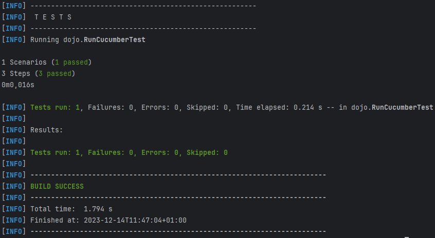

= R5.A.08 -- Dépôt pour les TPs
:icons: font
:MoSCoW: https://fr.wikipedia.org/wiki/M%C3%A9thode_MoSCoW[MoSCoW]

Ce dépôt concerne les rendus de mailto:quentin.beaufort@etu.univ-tlse2.fr[Quentin Beaufort].

== TP1

.is_it_friday_yet.feature
[source, java]
----
Feature: Is it Friday yet?
  Everybody wants to know when it''s Friday
  Scenario Outline:
    Examples:
      | day  | answer |
      | Friday | TGIF |
      | Sunday | Nope |
      | anything else! | Nope
    Given today is {day}
    When I ask whether it''s Friday yet
    Then I should be told {answer}
----

Les tests ne marchent pas
//.Exemple d'image insérée en asciidoc
//image::artifacts-r303.svg[width=80%]

== TP2

.Order.java
[source, java]
----
package dojo;

import java.util.ArrayList;
import java.util.List;

public class Order {
    protected String owner;
    protected String target;
    protected List<String> cocktails = new ArrayList<String>();

    public Order() {
    }

    public List<String> getCocktails() {
        return cocktails;
    }

    public String getOwner() {
        return owner;
    }

    public void declareOwner(String owner) {
        this.owner = owner;
    }

    public String getTarget() {
        return target;
    }

    public void declareTarget(String target) {
        this.target = target;
    }
}
----

